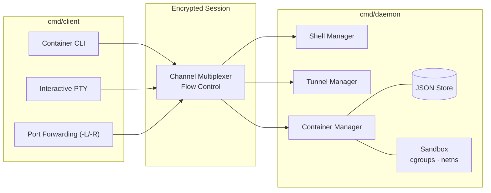

# ShellForge

ShellForge gives you authenticated, end-to-end encrypted access to remote machines and the containers running on them, all over a single multiplexed TCP connection. Where a traditional SSH stack stops at shells and port forwarding, ShellForge treats containers as first-class citizens: a client can remotely create, boot, exec into, and stream logs from Podman/Docker environments that are configurable, provisioned and resource-limited by the daemon and bound to a specific key pair.

## Features
- Remote container Creation/management
- Per-key isolated environments
- Secure remote shell (PTY)
- Local and remote TCP forwarding (`-L` / `-R`)
- Built-in flow control

## Architecture



## Quick Start
> Requires Go 1.25+. Container features require Podman on the daemon host; PAM auth requires the system PAM libraries.

```bash
git clone https://github.com/the-mhdi/shellforge
cd shellforge
go build ./cmd/daemon
go build ./cmd/client
```

## Documentation

See the `docs/` directory:

- architecture.md
- protocol.md
- cryptography.md
- authentication.md
- configuration.md
- containers.md
- wire-format.md

BE CAREFUL Not independently security audited.

## License

Apache 2.0
